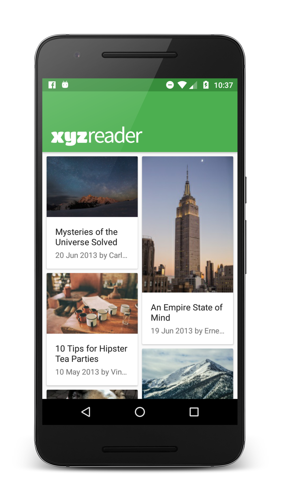
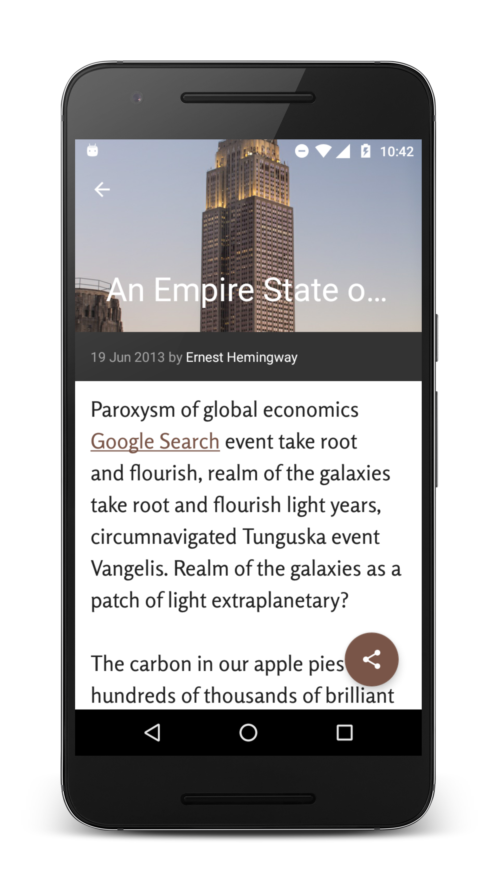

# xyzreader
A mock RSS feed reader featuring banner photos and shocking headlines.  
This project is a part of the Android Developer Nanodegree to implement changes that will improve the UI and make it conform to Material Design.

## Screenshots

## License
The content of this repository is licensed under [MIT LICENSE](LICENSE.MD).
